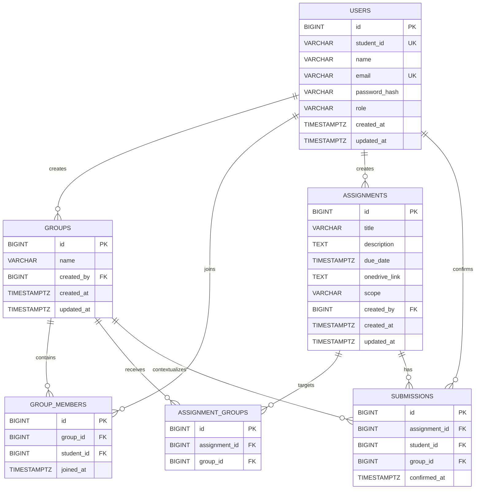

# Joineazy Database Design

Joineazy uses PostgreSQL with six primary tables:

- `users`
- `groups`
- `group_members`
- `assignments`
- `assignment_groups`
- `submissions`

## Entity Relationship Diagram



## Relationships

### Users and Groups

A student can create multiple groups:

```text
users.id
    ↓
groups.created_by
```

A student can also belong to multiple groups through `group_members`.

This creates a many-to-many relationship:

```text
users
   ↓
group_members
   ↑
groups
```

`group_members` prevents the same student from being added to the same group more than once.

---

## Groups and Assignments

An assignment can either target:

```text
scope = all
```

or:

```text
scope = groups
```

For `scope = groups`, assignment-to-group relationships are stored in:

```text
assignment_groups
```

This provides a many-to-many relationship:

```text
assignments
     ↓
assignment_groups
     ↑
groups
```

One assignment may therefore be assigned to multiple groups.

One group may also receive multiple assignments.

---

## Assignment Submissions

Joineazy does not store uploaded assignment files.

Students upload their files externally using the professor-provided OneDrive link and then confirm submission in Joineazy.

A confirmation is stored in:

```text
submissions
```

Each row records:

```text
assignment
student
optional group context
confirmation timestamp
```

A student can confirm an assignment only once.

The unique relationship is:

```text
assignment_id + student_id
```

---

## Assignment Scope

### All Students

When:

```text
scope = all
```

there are no required rows in `assignment_groups`.

Every registered student is considered eligible for the assignment.

### Specific Groups

When:

```text
scope = groups
```

the assignment must contain at least one corresponding row in:

```text
assignment_groups
```

Students gain access when they belong to at least one targeted group.

---

## Group Name Uniqueness

Group names are unique per creator rather than globally.

Allowed:

```text
Student A → Team Alpha
Student B → Team Alpha
```

Rejected:

```text
Student A → Team Alpha
Student A → Team Alpha
```

The comparison is case-insensitive.

Therefore these are treated as duplicates for the same creator:

```text
Team Alpha
team alpha
TEAM ALPHA
```

---

## Assignment Title Rules

Assignment titles are not globally unique.

However, the application prevents the same professor from assigning the same title to the same audience multiple times.

For example:

```text
Group Presentation → Team Alpha
Group Presentation → Team Alpha
```

is rejected.

But:

```text
Group Presentation → Team Alpha
Group Presentation → Team Beta
```

is allowed.

An assignment assigned to all students also blocks another assignment with the same title from being created for a subset of those students.

---

## Cascading Deletes

Where appropriate, foreign keys use cascading behavior.

For example, deleting a group removes related:

```text
group_members
assignment_groups
```

records.

This prevents orphaned relationship rows.

---

## Progress Calculation

Progress percentages are not stored directly.

They are calculated dynamically from:

```text
group membership
+
assignment eligibility
+
submission confirmations
```

For example:

```text
Team Alpha
3 members

Assignment confirmations:
2

Progress:
2 / 3 × 100 = 66.67%
```

This prevents stored percentage values from becoming stale when group membership or submission data changes.

---

## Main Constraints

Important database/application constraints include:

- Unique email per user
- Unique student ID per student
- User role restricted to `student` or `admin`
- One membership per student per group
- One submission confirmation per student per assignment
- Foreign-key validation
- Case-insensitive group-name uniqueness per creator
- Transaction-based assignment/group updates
